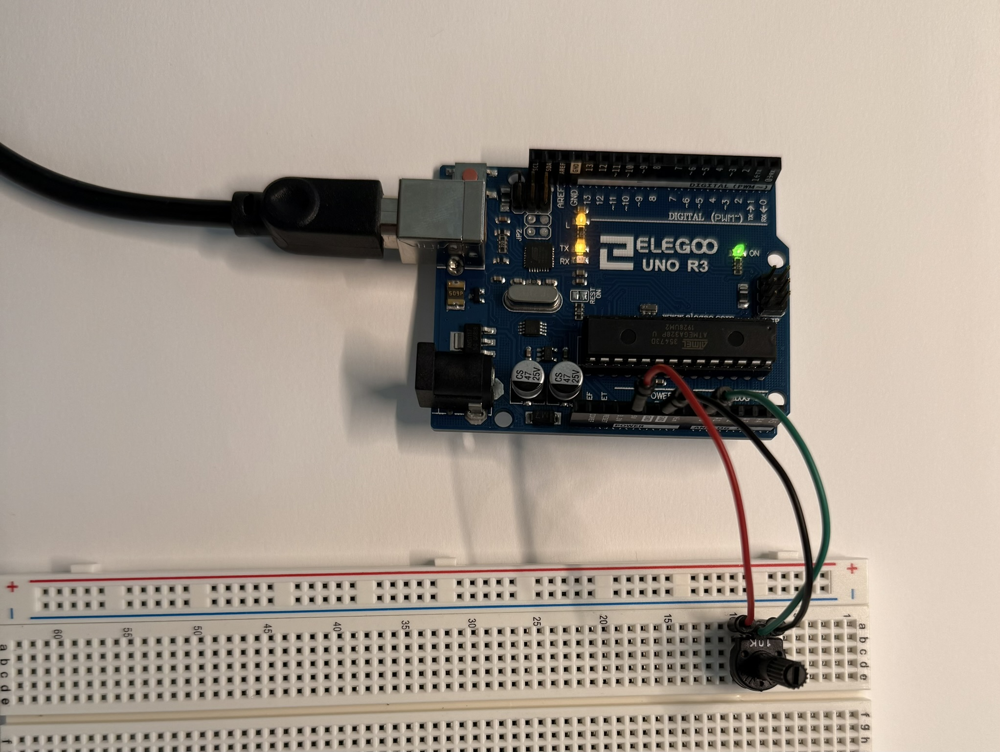
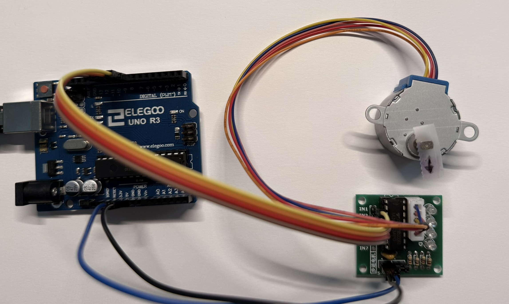

# PID Motor Control System

A closed-loop position control system using PID feedback control for precise stepper motor positioning.

## Overview

This project implements a PID controller in C++ to control stepper motor position using encoder feedback for high-precision angular positioning.

## Hardware Components

- Arduino Uno R3
- Stepper Motor + ULN2003 Driver
- Rotary Encoder Module
- Potentiometer (setpoint input)
- LCD1602 Display
- Breadboard & jumper wires

## Features

- PID position control
- Real-time encoder feedback
- LCD status display
- Potentiometer setpoint adjustment
- Serial monitoring and debugging

## Setup


## Implementation Progress

- [ ] Basic stepper motor control
- [ ] Encoder reading with interrupts
- [ ] PID algorithm implementation
- [ ] LCD display interface
- [ ] System integration and tuning
- [ ] Performance testing and optimization

## Performance Targets

- Position accuracy: ±1° (target)
- Settling time: <500ms (target)
- Update frequency: 20Hz+ (target)

## Usage

1. Power on system
2. Adjust potentiometer for desired position
3. Monitor performance via LCD and serial output

## Component Technical Notes 

- **The Potentiometer**: A variable resistor; they function as voltage dividers that can adjust voltage and mesure electric potential
  * specific potentiometer used has maximum resistance of 10k ohms, contains three pins: pin 1 & 3 (outer pins) connect to either power or GND, pin 2 (middle pin) is the "wiper" or signal pin. when you turn the knob on the potentiometer, you change the wiper's position which in turn changes the resistance and voltage output.

<div style="text-align: center;">
  
</div>

```c++
#include <Arduino.h>

void setup() {
    // sets data rate in bits per second (baud) for serial data transmission
    Serial.begin(9600); // opens serial port, 9600 bps

    // prints data to the serial port as human-readable ASCII text
    Serial.println("Potentiometer Test Starting...");
}

void loop() {
    // analogRead() reads value from specified analog input pin
    int potValue = analogRead(A0); // store analog value into variable potValue
    Serial.print("Potentiometer Value: ");
    Serial.println(potValue);
    // delay pauses program for a certain amount of time
    delay(200); // delay for 200ms
}
```

- **Stepper Motor**: A type of motor that moves in precise, discrete steps rather than the rotation of a DC motor. 
  * Inside, it has multiple coils that are energized in a specific sequence to create a magnetic field, which than can move the motor's rotor a little bit at a time.

- **ULN 2003 Stepper Motor Module**: Used alongside the stepper motor since you cannot directly connect it to an arduino (not enough current supplied by arduino).
  * "Built around a ULN2003A integrated circuit, which is a Darlington transistor array. This chip acts as a "buffer" or "switch" that allows a small signal from the Arduino to control the higher current needed by the stepper motor."
  * the module has 4 input pins (IN1-IN4) that connect to the arduino's digital pins and a five pin socket that the stepper motor plugs directly into. Also contains a power input.

<div style="text-align: center;">
  
</div>


```c++
#include <Arduino.h>
#include <Stepper.h> // use built-in Stepper library for Arduino

#define STEPS_PER_REVOLUTION 2048 // define a constant (2048 steps for full rev.)

Stepper myStepper(STEPS_PER_REVOLUTION, 8, 10, 9, 11); // had to change 9,10 order

void setup() {
  // setSpeed() sets motor speed in RPM
  // doesn't make motor turn, just sets speed at which it will when step() is called
  myStepper.setSpeed(15);

  Serial.begin(9600);
}

void loop() {
    // rotate motor one full revolution clockwise
  Serial.println("Moving clockwise...");
  // step() turns motor a specific number of steps
  myStepper.step(STEPS_PER_REVOLUTION);
  delay(500);
  
  // rotate motor one full revolution counter-clockwise
  Serial.println("Moving counter-clockwise...");
  myStepper.step(-STEPS_PER_REVOLUTION);
  delay(500);
}
```


## Results

*Document actual performance metrics and test results here.*
