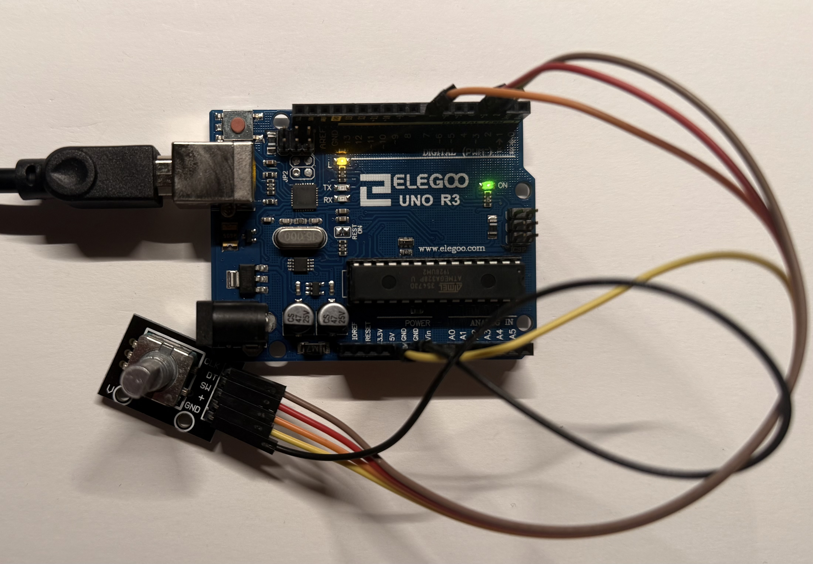
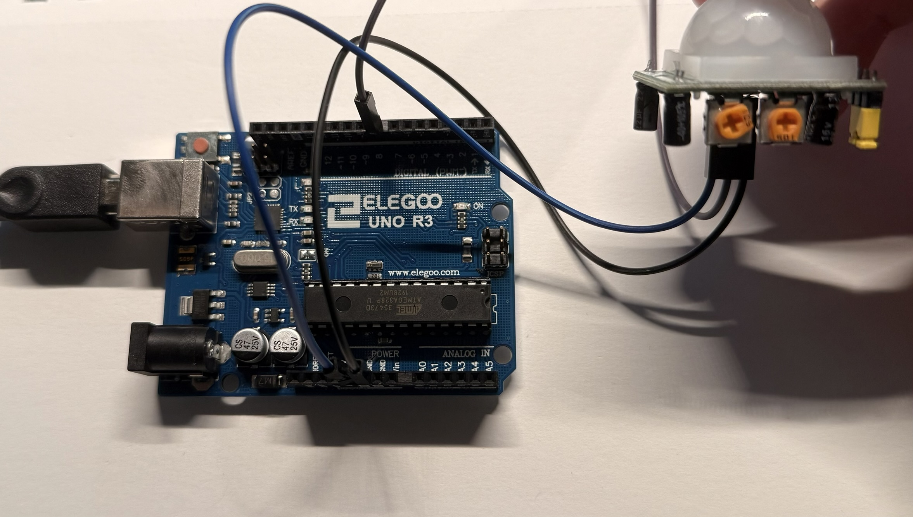
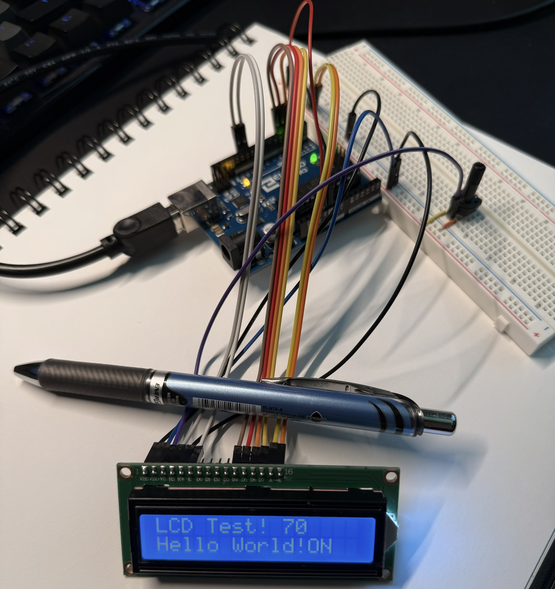

- **The Potentiometer**: A variable resistor; they function as voltage dividers that can adjust voltage and mesure electric potential
  * specific potentiometer used has maximum resistance of 10k ohms, contains three pins: pin 1 & 3 (outer pins) connect to either power or GND, pin 2 (middle pin) is the "wiper" or signal pin. when you turn the knob on the potentiometer, you change the wiper's position which in turn changes the resistance and voltage output.

<div style="text-align: center;">
  
</div>

```c++
#include <Arduino.h>

void setup() {
    // sets data rate in bits per second (baud) for serial data transmission
    Serial.begin(9600); // opens serial port, 9600 bps

    // prints data to the serial port as human-readable ASCII text
    Serial.println("Potentiometer Test Starting...");
}

void loop() {
    // analogRead() reads value from specified analog input pin
    int potValue = analogRead(A0); // store analog value into variable potValue
    Serial.print("Potentiometer Value: ");
    Serial.println(potValue);
    // delay pauses program for a certain amount of time
    delay(200); // delay for 200ms
}
```

- **Stepper Motor**: A type of motor that moves in precise, discrete steps rather than the rotation of a DC motor. 
  * Inside, it has multiple coils that are energized in a specific sequence to create a magnetic field, which than can move the motor's rotor a little bit at a time.

- **ULN 2003 Stepper Motor Module**: Used alongside the stepper motor since you cannot directly connect it to an arduino (not enough current supplied by arduino).
  * "Built around a ULN2003A integrated circuit, which is a Darlington transistor array. This chip acts as a "buffer" or "switch" that allows a small signal from the Arduino to control the higher current needed by the stepper motor."
  * the module has 4 input pins (IN1-IN4) that connect to the arduino's digital pins and a five pin socket that the stepper motor plugs directly into. Also contains a power input.

<div style="text-align: center;">
  
</div>


```c++
#include <Arduino.h>
#include <Stepper.h> // use built-in Stepper library for Arduino

#define STEPS_PER_REVOLUTION 2048 // define a constant (2048 steps for full rev.)

Stepper myStepper(STEPS_PER_REVOLUTION, 8, 10, 9, 11); // had to change 9,10 order

void setup() {
  // setSpeed() sets motor speed in RPM
  // doesn't make motor turn, just sets speed at which it will when step() is called
  myStepper.setSpeed(15);

  Serial.begin(9600);
}

void loop() {
    // rotate motor one full revolution clockwise
  Serial.println("Moving clockwise...");
  // step() turns motor a specific number of steps
  myStepper.step(STEPS_PER_REVOLUTION);
  delay(500);
  
  // rotate motor one full revolution counter-clockwise
  Serial.println("Moving counter-clockwise...");
  myStepper.step(-STEPS_PER_REVOLUTION);
  delay(500);
}
```

- **Rotary Encoder Module**: Basically a sensor that detects rotation and converts it into digital signals.
  * There are metal contacts/optical sensors inside the encoder; as you rotate, they create two square wave signals (A and B). Why two? One detects how much it rotated, and the other detects in which direction (which signal comes first since it is out of phase)
  * the signals are 90 degrees out of phase (one leads the other)

<div style="text-align: center;">
  
</div>

test 1: rotate encoder and verify if values change (from 0 -> 1 -> 0 as you rotate)
```c++
void setup() {
  Serial.begin(9600);
  pinMode(2, INPUT_PULLUP); // Pin 2 now has internal pullup
  // Encoder CLK connects between Pin 2 and GND
  // When encoder "clicks", it briefly connects Pin 2 to GND (LOW)
  // Otherwise, Pin 2 stays HIGH due to pullup
  pinMode(3, INPUT_PULLUP);

  Serial.println("Encoder Test Started");
}

void loop() {
  Serial.print("A: ");
  Serial.print(digitalRead(2));
  Serial.print(" B: ");
  Serial.println(digitalRead(3));
  delay(100);
}
```

test 2: direction of rotation and pulses per revolution (PPR = ~20)
```c++
// volatile keyword to tell compiler that the variable can change unexpectedly
// ..and to always read actual value from memory
volatile long encoderCount = 0;
int lastA = 0;

void readEncoder();

void setup() {
  Serial.begin(9600);
  pinMode(2, INPUT_PULLUP);
  pinMode(3, INPUT_PULLUP);
  // (digitalPinToInterrupt(pin), ISR, mode)
  // Interrupt Service Routine (ISR); function that returns nothing/has no parameters
  // CHANGE as mode to trigger the interrupt whenever the pin changes value
  attachInterrupt(digitalPinToInterrupt(2), readEncoder, CHANGE);
}

void readEncoder() { // need to define this before setup()
  int A = digitalRead(2); // set pin 2 reading to A
  int B = digitalRead(3); // set pin 3 reading to B
  
  if (lastA == 0 && A == 1) {
    if (B == 0) encoderCount++;
    else encoderCount--;
  }
  lastA = A;
}

void loop() {
  Serial.print("Position: ");
  Serial.println(encoderCount);
  delay(200);
}
```

- **PIR (Passive Infared) Sensor**: "detects motion by sensing changes in IR (heat) radiation within its field of view"
  * Has two potentiometers that perform distinct things: one can adjust the sensitivity (from 3 meters to 7 meters) and the other can adjust the delay (from 3 seconds to 5 minutes)
  * Observations: When testing, the detection range seemed to be at least 3 meters (width of room), sensitivity seemed to be pretty high (when moving with my whole body or making fast movements) and the coverage area seemed to be ~150 degrees when the sensor was on its side facing the room (opposite ends didn't seem to pick up motion)

<div style="text-align: center;">
  
</div>

```c++
int pirPin = 8;
int pirState = LOW; // LOW state means there is no motion

void setup() {
  Serial.begin(9600);
  pinMode(pirPin, INPUT);
  Serial.println("PIR Test Started");
  Serial.println("Warming up sensor (60 seconds)...");
  delay(60000); // PIR needs time to calibrate
  Serial.println("Ready to detect motion!");
}

void loop() {
  int motion = digitalRead(pirPin);
  
  if (motion == HIGH) {
    if (pirState == LOW) {
      Serial.println("MOTION DETECTED!");
      pirState = HIGH; // change state to moving
    }
  } else {
    if (pirState == HIGH) {
      Serial.println("Motion ended");
      pirState = LOW; // change state to static (no movement)
    }
  }
  
  delay(100);
}
```
- **LCD1602 Interface/Display**: contains 16 columns and 2 rows which is good for displaying short messageas and sensor data (using 4-bit mode in this project)
  * Power and GND: VSS and VDD pins (used breadboard to provide power to other pins)
  * Backlight control: A & K pins

<div style="text-align: center;">
  
</div>

```c++
#include <Arduino.h>
#include <LiquidCrystal.h> // needed for controlling the LCD

// Creates variable of type LiquidCrystal (using 4 data lines; omit d0-d3)
/*
SYNTAX: 
LiquidCrystal(rs, enable, d4, d5, d6, d7)
LiquidCrystal(rs, rw, enable, d4, d5, d6, d7)
LiquidCrystal(rs, enable, d0, d1, d2, d3, d4, d5, d6, d7)
LiquidCrystal(rs, rw, enable, d0, d1, d2, d3, d4, d5, d6, d7)
*/
// Initialize library with interface pins and the corr. # (RS, E, D4, D5, D6, D7)
LiquidCrystal lcd(12, 11, 5, 4, 3, 2);

void setup() {
  Serial.begin(9600);
  Serial.println("LCD Test Starting...");
  
  // begin() function used to set up LCD's dimensions 
  // syntax: lcd.begin(cols, rows, charsize(optional) )
  lcd.begin(16, 2);
  
  // print() function used to print text
  lcd.print("LCD Test!"); // print "LCD Test!" to screen

  // setCursor() function used to set the location at 
  // ..which subsequent text written to the LCD will be displayed.
  lcd.setCursor(0, 1);  
  lcd.print("Hello World!");
  
  // for debugging purposes
  Serial.println("LCD should now display text");
  Serial.println("If blank, adjust contrast potentiometer");
}

void loop() {
  // Display a dynamic counter on the top row
  lcd.setCursor(10, 0);  
  lcd.print("    ");     // Clear previous number
  lcd.setCursor(10, 0);
  // millis() function returns number of milliseconds since arduino started
  lcd.print(millis()/1000);  // Show seconds elapsed
  
  // Display status on second row
  lcd.setCursor(12, 1);  // Position: column 12, row 1
  if ((millis()/1000) % 2 == 0) {
    lcd.print("ON ");
  } else {
    lcd.print("OFF");
  }
  
  delay(500); // allow time for transitions
}
```


*template*

- **___**:
  * 
  * 

<div style="text-align: center;">
  
</div>

```c++

```